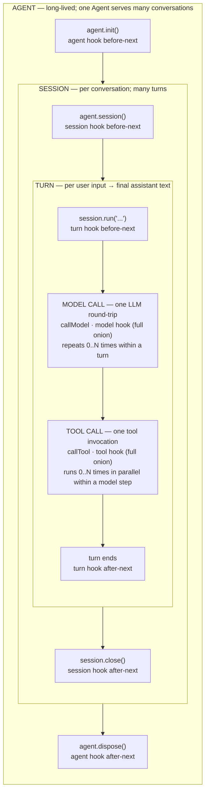
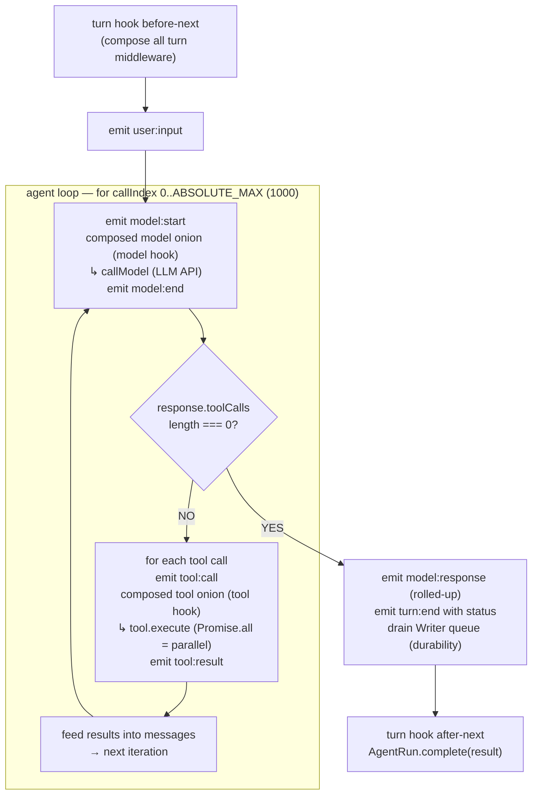
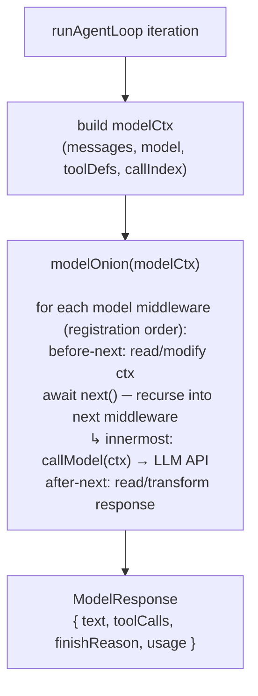
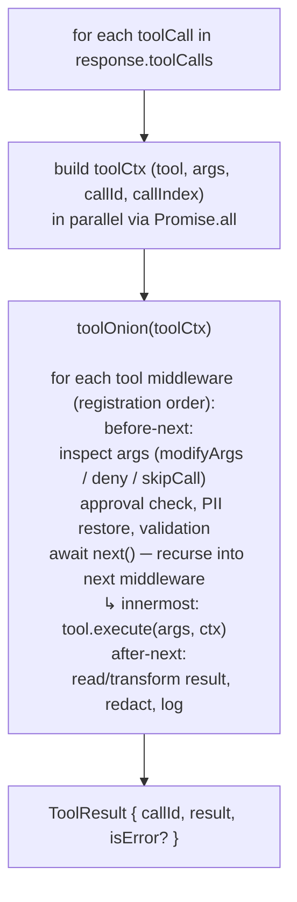

# Agent Loop

> The five lifecycle layers, the model→tool→model cycle within a turn,
> and where each middleware hook fires. Combines design-decision rationale
> (why explicit lifecycle, why first-class `Session`) with the runtime
> reference (how the loop runs at execution time).

For the typed event log that records what flows through the loop, see
[`event-log.md`](event-log.md). For the `(ctx, next)` middleware contract
in detail, see [`middleware-interface.md`](middleware-interface.md). For
the framework's overall philosophy, see
[`agent-express-concept.md`](agent-express-concept.md).

---

## 1. Five lifecycle layers

The runtime is six nested layers (the `agent` lifecycle wraps everything;
the `session` lifetime wraps many turns; each turn contains many model and
tool calls). Two of the hooks (`agent`, `session`) are wrapper-shaped —
init/dispose semantics. The other three (`turn`, `model`, `tool`) follow
the `(ctx, next)` onion pattern around exactly one execution.



A single middleware can implement any subset of the five hooks; it doesn't
have to implement all of them. See
[`middleware-interface.md`](middleware-interface.md) for the contract
details and the `Middleware` type.

---

## 2. Why explicit lifecycle (design rationale)

The shape above didn't come from nowhere. It was the conscious choice
between several patterns the agent-framework ecosystem has tried.

### 2.1 Init / dispose

| Framework | Init | Dispose |
|-----------|------|---------|
| Vercel AI SDK | None. Stateless config. | None. |
| Mastra | None. `MCPClient.disconnect()` separate. | None on Agent. |
| OpenAI Agents SDK | None. MCP lifecycle on client. | None on Agent. |
| LangGraph | `.compile()` — sync, not async init. | None. |
| Google ADK | `Runner` async context manager | `runner.close()` or `async with` |
| CrewAI | None. | None. |
| MS Agent Framework | `async with client.as_agent() as agent:` | Context manager `__aexit__` |
| **Agent Express** | **Explicit `agent.init()`** | **Explicit `agent.dispose()`** |

Most frameworks do init lazily (inside the first run) or have no init at
all. That's fine for stateless agents, but breaks when you have MCP
servers to connect, tools to register, or clients to allocate. Lazy init
hides connection errors as run-time errors, prevents pre-warming, and
forbids separate error handling for setup vs execution.

Only Google ADK and MS Agent Framework have explicit lifecycle. Agent
Express follows the same shape, with explicit `agent.init()` /
`agent.dispose()` and `using` support (TS 5.2+ Explicit Resource
Management).

### 2.2 Multi-turn / Session

| Framework | Session object? | Multi-turn approach |
|-----------|----------------|---------------------|
| Vercel AI SDK | No. Client manages `messages[]`. | Manual append of `result.response.messages` |
| Mastra | No object. `Memory` with thread/resource IDs. | `generate(msg, { memory: { thread } })` |
| OpenAI Agents SDK | `Session` interface (or server-side `conversationId`) | 3 options: manual / server / Session |
| LangGraph | No object. `Checkpointer` + `thread_id`. | `app.invoke(msg, { configurable: { thread_id } })` |
| Google ADK | **Yes.** `Session(id, state, events)` via `SessionService` | `runner.run_async(user_id, session_id, msg)` |
| CrewAI | No. Task-oriented. | No native multi-turn. |
| MS Agent Framework | **Yes.** `AgentSession(session_id, state)` | `agent.run("msg", session=session)` |
| **Agent Express** | **Yes.** First-class `Session` class with state, events, history | `session.run("msg")` |

Most frameworks treat session as a string ID plus an external state store.
That works, but it makes session lifetime invisible — there's no object
to attach lifecycle hooks to, no clear "this session ended" moment, no
natural place to compose state across turns.

A first-class `Session` object maps cleanly to the `session` middleware
hook (the hook's lifetime IS the session's lifetime), gives state and
events a home, and makes `await using session = agent.session()` work.

### 2.3 Middleware composition

| Framework | Model | Levels |
|-----------|-------|--------|
| Vercel AI SDK | Model-level middleware only | model |
| Mastra | HTTP middleware (Hono) + tool hooks + processors | HTTP, tool |
| OpenAI Agents SDK | EventEmitter (not composable) + guardrails | events only |
| LangGraph | Graph nodes = middleware. `preModelHook/postModelHook` | graph nodes |
| Google ADK | 6 callbacks: `before/after_agent`, `before/after_model`, `before/after_tool` | agent, model, tool |
| CrewAI | Lifecycle callbacks: `before_kickoff`, `step_callback` | crew, agent, task |
| MS Agent Framework | **Onion middleware**: Agent/Chat/Function with `call_next()` | agent, model, tool |
| **Agent Express** | **5-level onion**: agent, session, turn, model, tool | All five |

Agent Express has the most granular onion in the market — five distinct
layers, each with the same `(ctx, next)` shape. This is the structural
differentiator: anything you want to do (cost cap, retry, redaction,
approval, observability) lives at exactly one layer where it belongs,
composes with everything else through `await next()`, and uses the
muscle memory every backend developer already has.

### 2.4 What this gives you

```typescript
// 1. Create + configure
const agent = new Agent({
  name: "support",
  model: "anthropic/claude-sonnet-4-6",
  instructions: "...",
})
  .use(guard.budget({ limit: 1.0 }))
  .use(tools.mcp({ name: "crm", transport: "stdio", command: "..." }))

// 2. Explicit init — MCP connects, tools register
await agent.init()

// 3. Session — first-class object with state + events + history
const session = agent.session()
const r1 = await session.run("Hello").result
const r2 = await session.run("Follow up").result    // history + state preserved
await session.close()

// 4. Convenience — auto-init + auto-session for scripts/tests
const { text } = await agent.run("Quick question").result

// 5. Cleanup
await agent.dispose()

// 6. Bonus: using (TS 5.2+ Explicit Resource Management)
await using session = agent.session()
```

---

## 3. The agent loop within one turn

`session.run("hello")` triggers a single turn. Inside the turn, the loop
in [`src/loop.ts`](../../src/loop.ts) runs `model → check response →
execute tools → repeat` until the model returns a final text response (no
tool calls).



The loop is intentionally minimal. It runs the model, checks if the
response includes tool calls, executes those (in parallel), feeds the
results back, and repeats. That's it. Everything else — retry on
transient failures, budget enforcement, cost tracking, logging,
validation, PII redaction, model routing, etc. — is layered through
middleware, not hardcoded into the loop.

The hardcoded `ABSOLUTE_MAX = 1000` is a safety net to prevent
pathological infinite loops; the actual cap users care about is
`guard.maxIterations()` (default in `defaults()`).

---

## 4. The two onions: model and tool

Within one iteration of the loop, two onion hooks fire. Each one wraps
the actual call (LLM round-trip or tool execution).

### 4.1 Model onion



What `model` middleware can do:
- Mutate `ctx.messages` before the call (inject system prompts, redact
  PII, trim to context window) — see
  [`memory.compaction`](../../src/middleware/memory/compaction.ts)
- Override `ctx.model` (route by complexity) — see
  [`model.router`](../../src/middleware/model/router.ts)
- Filter `ctx.toolDefs` (remove tools the model shouldn't see this turn)
- Short-circuit: `ctx.skipCall(syntheticResponse)` — useful for testing
  and for `guard.input` rejection paths
- Wrap the call with retry logic — see
  [`model.retry`](../../src/middleware/model/retry.ts)
- Read the response after `next()` returns — track usage, log, validate

### 4.2 Tool onion



What `tool` middleware can do:
- Approve / deny / modify arguments — see
  [`guard.approve`](../../src/middleware/guard/approve.ts) (HITL)
- Restore redacted PII for the actual tool call (the model saw `[EMAIL]`
  but the tool gets `john@example.com`) — see
  [`guard.piiRedact`](../../src/middleware/guard/pii-redact.ts)
- Skip execution and return a synthetic result (testing, mock data)
- Wrap with timeout — built into the loop (per-tool `tool.timeout`
  field, default 30s)
- Record the call for observability — see
  [`observe.tools`](../../src/middleware/observe/tools.ts)
- Race tool calls against budget enforcement —
  [`guard.budget`](../../src/middleware/guard/budget.ts)

Tools execute in parallel by default (one `Promise.all` per model step).
This is the right default for IO-bound agent work; if a specific tool
shouldn't run concurrently with siblings, that tool's middleware can
serialize it.

---

## 5. What fires where — quick reference

| Layer | Fires when | Common middleware |
|---|---|---|
| `agent` before | `agent.init()` | Connect MCP servers, register tools, allocate clients |
| `agent` after | `agent.dispose()` | Close MCP servers, release clients, flush metrics |
| `session` before | `session._initOnion()` (called by `agent.session()`) | Load session state from `SessionStore`, replay events |
| `session` after | `session.close()` | Flush counters, log session-level summary |
| `turn` before | `session.run(input)` after `turn:start` event | Inject system context, start budget envelope, start trace span |
| `turn` after | After loop completes, before `turn:end` event drain | Record duration, log turn summary, finalize budget |
| `model` (full onion) | Each LLM call within the turn loop (0..N per turn) | Route by complexity, retry, redact, validate input, track usage |
| `tool` (full onion) | Each tool invocation within a model step (0..N in parallel) | Approve, deny, modify args, restore PII, time, record |

For the full hook signatures and the `Middleware` interface, see
[`middleware-interface.md`](middleware-interface.md).

---

## 6. Composition: how `.use()` order matters

Middleware composes via `agent.use(...)`. Order matters because middleware
runs as nested onion layers — earlier `.use()` calls become *outer*
layers. A request enters from outermost in, hits the innermost (the
actual call), then unwinds outward.

```typescript
agent
  .use(observe.duration())   // outermost — sees everything wrapped
  .use(observe.usage())
  .use(guard.budget({ limit: 1.0 }))
  .use(guard.piiRedact())    // inner — closer to the model
  .use(model.retry())
```

For a model call, that gives this nesting:

```
observe.duration  ┐
  observe.usage   │
    guard.budget  │ wrap before
      piiRedact   │
        model.retry  ──── (innermost) → callModel()
      piiRedact   │
    guard.budget  │ unwrap after
  observe.usage   │
observe.duration  ┘
```

Each layer sees the request on the way in (before `next()`) and the
response on the way out (after `next()` returns). `guard.budget` checks
the running cost against the cap *before* the call (cheap) and adds the
incremental cost *after* (accurate). `observe.duration` brackets the
whole thing.

The `defaults()` preset prepends a sensible stack at agent construction:
`model.retry`, `observe.usage`, `observe.tools`, `observe.duration`,
`guard.maxIterations`. Opt out with `defaults: false`.

See [`middleware-interface.md`](middleware-interface.md) "Order and
composition" for more on how `.use()` registration interacts with the
`composeHooks` executor.

---

## 7. Control flow: short-circuits, abort, errors

Three ways a middleware can change control flow:

### 7.1 `ctx.abort(reason)` — hard stop

Throws `AbortError` that unwinds the entire onion stack up to the session
level. The turn ends with `status: "aborted"` and the result promise
rejects. Use for unrecoverable conditions:

```typescript
turn: async (ctx, next) => {
  if (ctx.state["guard:budget:totalCost"] > LIMIT) {
    ctx.abort("Budget exceeded")  // emits turn:aborted, then throws AbortError
  }
  await next()
}
```

`ctx.abort` first emits a `turn:aborted` event with `reason: "abort"` and
the supplied message, then throws. `executeTurn`'s catch block records
`status: "aborted"` on the `turn:end` event. The `error` event is **not**
emitted for abort flow — predictable guard interventions own
`turn:aborted`, and `error` stays reserved for unexpected exceptions.

### 7.2 Short-circuit: `ctx.skipCall` / `ctx.deny`

In `model` and `tool` hooks, the context exposes "early exit" methods:

```typescript
// Model hook
model: async (ctx, next) => {
  if (cached(ctx.messages)) {
    ctx.skipCall(cachedResponse)   // bypass LLM call
  }
  return next()
}

// Tool hook
tool: async (ctx, next) => {
  if (!approved(ctx.tool.name, ctx.args)) {
    ctx.deny("not authorized")   // tool returns error result, loop continues
  }
  await next()
}
```

`ctx.deny` differs from `ctx.abort`: deny is a soft failure (the model
sees a tool error, the turn continues); abort is a hard failure (the
turn ends).

### 7.3 Throwing from middleware

If a `model` middleware throws an unexpected exception, the loop's
`try { ... }` in `executeTurn` catches it. The turn ends with
`status: "failed"`, an `error` event is emitted with
`{ scope: "turn", kind, message, cause? }`, and the result promise
rejects with the original error.

A middleware that wants to signal a *predictable* harness intervention
(rather than an unexpected failure) should emit a `turn:aborted` event
with a `reason` first, then throw `AbortError` (or call `ctx.abort()`,
which does both). This is the pattern the built-in guards
(`guard.budget`, `guard.timeout`, `guard.maxIterations`,
`guard.rateLimit`, `guard.input`, `guard.output`) already follow.

---

## 8. Where each event fires

```
session.run("hello")
  emit turn:start            ← Session.executeTurn
  emit user:input            ← Session.executeTurn

  for (callIndex = 0; ...; ) {
    emit model:start         ← loop.ts before modelOnion
    ── modelOnion ──         ← model middleware runs around callModel
    emit model:end           ← loop.ts after modelOnion (with text + usage)

    if (no tool calls) break

    for tool call in response.toolCalls (in parallel):
      emit tool:call         ← loop.ts before toolOnion
      ── toolOnion ──        ← tool middleware runs around tool.execute
      emit tool:result       ← inside toolOnion innermost (after execute)
  }

  emit model:response        ← Session.executeTurn (rolled-up final text)
  emit turn:end              ← Session.executeTurn (durability boundary)
                             ← writer.drain(sessionId)
```

Event payloads and the Zod schemas behind them: [`event-log.md`](event-log.md) § 12.

---

## 9. Reading the code

If you want to follow the actual control flow:

- [`src/agent.ts`](../../src/agent.ts) — `Agent.init()`, `Agent.session()`,
  `Agent.run()` convenience path; `agent` hook composition
- [`src/session.ts`](../../src/session.ts) — `Session.executeTurn`; the
  outermost orchestrator; emits `turn:start` / `user:input` /
  `model:response` / `turn:end`
- [`src/loop.ts`](../../src/loop.ts) — `runAgentLoop`; the inner
  model→tool→model cycle; emits `model:start/end` / `tool:call/result`
- [`src/executor.ts`](../../src/executor.ts) — `composeHooks`; the
  `(ctx, next)` onion executor
- [`src/context.ts`](../../src/context.ts) — context factory functions;
  defines what `ctx` looks like at each layer

**Sibling design documents**:
- [`agent-express-concept.md`](agent-express-concept.md) — the
  framework's overall positioning and why the loop is its primitive
- [`middleware-interface.md`](middleware-interface.md) — the
  `Middleware` contract for every hook fired in this loop
- [`event-log.md`](event-log.md) — the substrate that records what
  flows through the loop (every event in § 8 is defined there)
- [`providers.md`](providers.md) — how the model that the inner onion
  wraps is resolved from the `"provider/model"` string
- [`adapters.md`](adapters.md) — the contracts for stores / embed /
  search consumed by middleware that lives at the session and model
  layers
- [`observability.md`](observability.md) — six middlewares that read
  from this loop (turn / model / tool hooks)
- [`testing.md`](testing.md) — how this same loop runs unchanged with
  a `FunctionModel` substituted for the real provider
